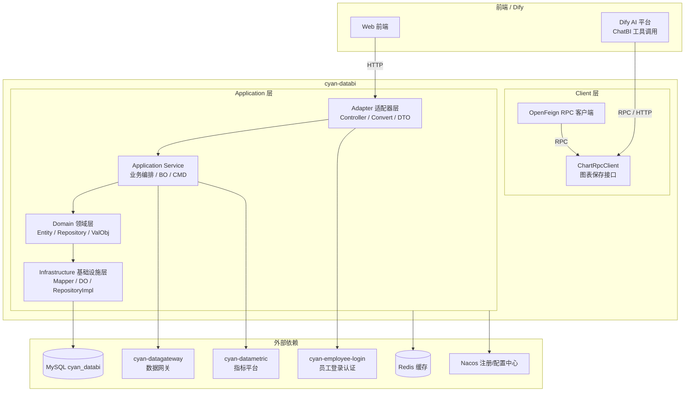

# cyan-databi

<p align="center">
  
  
  
  
  
  
</p>

**cyan-databi** 是 Cyan 智能分析平台（DataBI）的服务端核心，提供从指标建模、图表分析到数据看板的一站式数据可视化能力。支持自然语言对话生成图表（ChatBI），并以图表为原子单位构建灵活的数据看板，满足企业级数据消费与决策支持需求。

---

## 📋 目录

- [项目简介](#-项目简介)
- [系统架构](#-系统架构)
- [模块说明](#-模块说明)
- [技术栈](#-技术栈)
- [核心功能](#-核心功能)
- [快速开始](#-快速开始)
- [项目信息](#-项目信息)

---

## 🎯 项目简介

在现代数据驱动决策场景下，业务人员需要低门槛、高效率的数据分析工具。cyan-databi 定位于企业级智能分析引擎，核心能力包括：

- **零代码图表**：基于指标平台预置的指标/维度，拖拽或配置即可生成专业图表。
- **ChatBI 对话分析**：通过自然语言与 AI 助手对话，自动解析意图并生成分析图表，降低数据分析门槛。
- **数据看板**：以图表为最小原子单位，通过自由布局组合成个性化数据看板。
- **实时数据推送**：看板支持定时刷新与实时数据推送，确保决策数据时刻在线。

---

## 🏗 系统架构



> 项目遵循 **DDD 四层架构**（适配器层 → 应用层 → 领域层 → 基础设施层），通过充血模型与防腐层实现高内聚、低耦合的业务逻辑组织。

---

## 📦 模块说明

| 模块 | 说明 | 主要职责 |
|------|------|----------|
| `cyan-databi-application` | 应用服务模块 | 提供 HTTP API、业务应用服务、领域模型、数据持久化等完整服务端能力 |
| `cyan-databi-client` | 客户端 SDK 模块 | 对外暴露 OpenFeign RPC 接口，供其他微服务（如 Dify 工具链）调用保存图表等能力 |

### cyan-databi-application 包结构

```text
cyan-databi-application
├── adapter              # 适配器层：Controller、DTO、Convert
│   ├── analysis/http    # 分析执行接口（SQL 生成与执行、SQL 预览）
│   ├── chart/http       # 图表管理接口（CRUD）
│   ├── dashboard/http   # 看板管理接口（CRUD、布局配置）
│   └── dataset/http     # 数据集管理接口
├── application          # 应用层：Service、BO、CMD、Convert
│   ├── analysis         # 分析应用服务（SQL 构建、数据查询）
│   ├── chart            # 图表应用服务
│   ├── dashboard        # 看板应用服务
│   └── dataset          # 数据集应用服务
├── domain               # 领域层：Entity、Repository、ValObj、Query
│   ├── chart            # 图表领域（维度、指标、过滤、排序）
│   ├── dashboard        # 看板领域（布局、图表引用）
│   └── dataset          # 数据集领域（字段、源类型）
├── infra                # 基础设施层：Mapper、DO、RepositoryImpl、RPC
│   ├── persistence      # MyBatis Plus 持久化
│   └── rpc              # 内部 RPC 暴露（ChartRpcController）
└── Application.java     # Spring Boot 启动类
```

---

## 🛠 技术栈

| 技术 | 版本 | 用途 |
|------|------|------|
| Java | 21 | 编程语言 |
| Spring Boot | 3.3.13 | 基础框架 |
| Spring Cloud | — | 微服务基础设施（Nacos 注册/配置、OpenFeign） |
| MyBatis Plus | 3.5.7 | ORM 框架与数据访问 |
| MapStruct | 1.5.5.Final | 类型安全的对象映射 |
| Lombok | 1.18.42 | 代码简化 |
| MySQL | 8.x | 业务数据存储 |
| Redis | — | 缓存与分布式支持 |
| Nacos | — | 服务注册发现与配置中心 |
| Maven | — | 构建工具 |

---

## ✨ 核心功能

### 1. 图表分析（基于指标平台）
- 支持 **数据集分析（DATASET）** 与 **指标分析（METRICS）** 两种分析模式。
- 通过可视化配置维度、指标、过滤条件、排序规则，自动生成可执行的 SQL。
- 提供 SQL 预览能力，便于排查与调优。
- 支持图表类型：表格、柱状图、折线图、面积图、饼图、散点图、指标卡。

### 2. ChatBI — 自然语言对话生成图表
- 集成 Dify AI 平台，业务人员可通过自然语言描述分析需求。
- AI 自动调用指标平台能力，将意图转化为分析 DSL 并生成图表。
- 对话中生成的图表支持一键保存到平台，后续可在看板中复用。
- 对外暴露 `ChartRpcClient` 与 OpenAPI 工具定义（`dify-tools/save_chart.yaml`），便于 AI Agent 集成。

### 3. 数据看板
- **图表即原子单位**：每个图表独立配置、独立复用。
- **自由布局**：看板通过 JSON 布局配置（`layoutConfig`）灵活编排图表位置与尺寸。
- **图表引用**：看板以 `ChartRefValObj` 引用已有图表，实现一处修改、多处联动。

### 4. 数据刷新与推送
- 看板数据支持定时刷新策略，确保展示数据及时更新。
- 结合 WebSocket / SSE 等实时通道（基础设施就绪），可向客户端推送数据变更，实现秒级数据感知。

---

## 🚀 快速开始

### 环境要求

- JDK 21+
- Maven 3.9+
- MySQL 8.0+
- Redis 6.0+
- Nacos 2.x

### 1. 克隆项目

```bash
git clone git@github.com:cyan-daimao/cyan-databi.git
cd cyan-databi
```

### 2. 初始化数据库

创建数据库并导入初始表结构：

```sql
CREATE DATABASE cyan_databi DEFAULT CHARACTER SET utf8mb4 COLLATE utf8mb4_unicode_ci;
-- 根据项目提供的 SQL 脚本执行建表（如有）
```

> 表结构由 MyBatis Plus 自动维护或随版本发布 SQL 脚本，请联系运维获取最新初始化脚本。

### 3. 配置 Nacos

确保 Nacos 服务（默认 `10.0.0.2:8848`）已启动，并创建以下配置：

- `arch-base.yaml`（`DEFAULT_GROUP`，`dev` 命名空间）：基础框架配置
- 调整 `cyan-databi-application/src/main/resources/bootstrap-dev.yml` 中的数据库、Redis、Nacos 地址以匹配实际环境。

### 4. 本地启动

```bash
# 编译并跳过测试
mvn clean install -DskipTests

# 启动应用服务
cd cyan-databi-application
mvn spring-boot:run -Dspring-boot.run.profiles=dev
```

服务默认端口可通过 Nacos 配置调整，Dify 工具链中默认指向 `http://10.0.0.2:8085`。

### 5. 验证服务

```bash
curl -X POST http://localhost:8085/api/v1/analysis/preview-sql \
  -H "Content-Type: application/json" \
  -d '{"datasetId":"1","dimensions":[{"field":"dt"}],"metrics":[{"field":"gmv","aggregate":"SUM"}]}'
```

---

## 📄 项目信息

| 属性 | 值 |
|------|-----|
| GroupId | `com.cyan` |
| ArtifactId | `cyan-databi` |
| Version | `1.0-SNAPSHOT` |
| Java | 21 |
| Spring Boot | 3.3.13 |
| 主要开发者 | cy.Y |

---

> 如有问题或建议，欢迎提交 Issue 或联系项目维护者。
